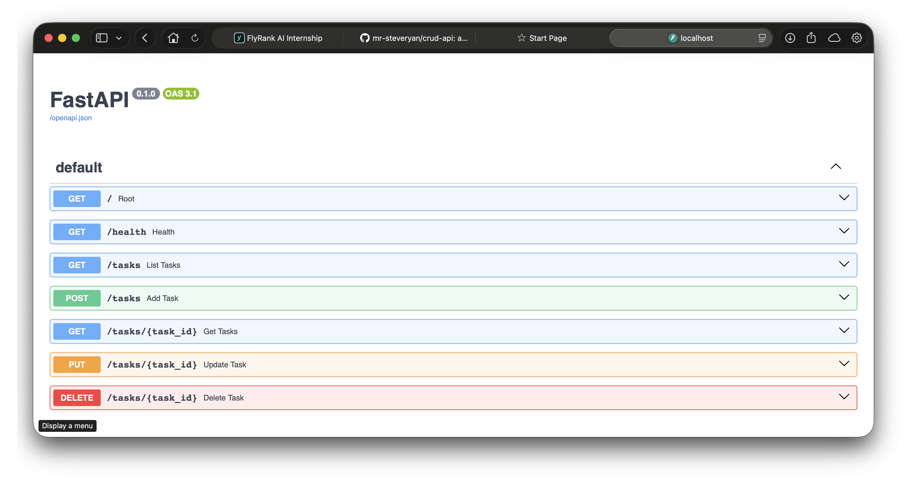
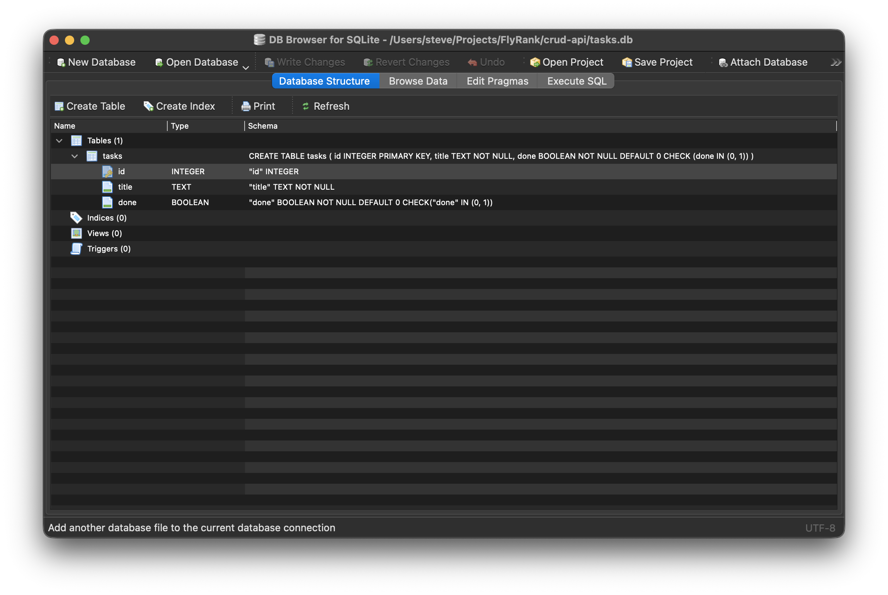

# task API

A minimal CRUD API built with FastAPI. Tasks are stored in a SQLite database, so data survives a restart.

## Why SQLite

- **Zero setup** — `sqlite3` ships with Python's standard library. No server to install, no connection string, no Docker.
- **Single file** — the whole database is one file you can copy, delete, or open in a viewer.
- **Right size for this API** — one table, one process, low traffic. Postgres would add operational cost with nothing to show for it.
- **Constraints in the schema** — `NOT NULL`, `CHECK (done IN (0, 1))` and `INTEGER PRIMARY KEY` (auto-assigns ids) enforce validity in the database instead of in Python.

## Where the database lives

`tasks.db` in the directory the server is started from — the project root if you follow the commands below.

The path is relative (`sqlite3.connect("tasks.db")` in `main.py`), so starting the server from a different directory creates a fresh, empty database there.

`init_db()` runs at import time: it creates the `tasks` table if missing and seeds three rows only when the table is empty.

## Install & run

Requires Python 3.14+ and [uv](https://docs.astral.sh/uv/).

```bash
uv sync
uv run uvicorn main:app --port 8000 --reload
```

Server runs at `http://localhost:8000`. `tasks.db` is created on first start.

To reset the data, delete the file and restart:

```bash
rm tasks.db
```

## Endpoints

| Method | Path | Description | Status |
|--------|------|-------------|--------|
| GET | `/` | API info | 200 |
| GET | `/health` | Health check | 200 |
| GET | `/tasks` | List all tasks | 200 |
| GET | `/tasks/{id}` | Get one task | 200 / 404 |
| POST | `/tasks` | Create task (`title` required) | 201 / 400 |
| PUT | `/tasks/{id}` | Update task (`title`, `done` required) | 200 / 400 / 404 |
| DELETE | `/tasks/{id}` | Delete task | 204 / 404 |

`done` comes back as `0` or `1` — SQLite has no boolean type, it stores them as integers.

## API docs

Swagger UI at `http://localhost:8000/docs` (or Interactive docs at `http://localhost:8000/redoc`).



## Database viewer



## SQL used

The schema, created by `init_db()`:

```sql
CREATE TABLE IF NOT EXISTS tasks (
    id          INTEGER PRIMARY KEY,
    title       TEXT NOT NULL,
    done        BOOLEAN NOT NULL DEFAULT 0 CHECK (done IN (0, 1))
);
```

Seed rows, inserted only when the table is empty:

```sql
SELECT 1 FROM tasks LIMIT 1;
INSERT INTO tasks (id, title, done) VALUES (:id, :title, :done);
```

The queries behind each endpoint:

```sql
-- GET /tasks
SELECT * FROM tasks;

-- GET /tasks/{id}
SELECT * FROM tasks WHERE id = ?;

-- POST /tasks   (id assigned by SQLite)
INSERT INTO tasks (title, done) VALUES (?, ?) RETURNING *;

-- PUT /tasks/{id}
UPDATE tasks SET title = ?, done = ? WHERE id = ? RETURNING *;

-- DELETE /tasks/{id}
DELETE FROM tasks WHERE id = ? RETURNING *;
```

`RETURNING *` gives back the affected row in one round trip, so the API can respond with the new state — and a `None` result means the id didn't exist, which is how 404s are detected.

Values are always passed as bound parameters (`?` / `:name`), never string-formatted into the SQL.

Inspect the database directly:

```bash
sqlite3 tasks.db ".schema"
sqlite3 tasks.db "SELECT * FROM tasks;"
```

## Testing with curl

### `GET /` — API info

Returns basic metadata about the API.

```bash
curl -s http://localhost:8000/
```

**Response**
```json
{"name":"Task API","version":"1.0","endpoints":"[/tasks]"}
```

### `GET /health` — Health check

Confirms the server is up.

```bash
curl -s http://localhost:8000/health
```

**Response**
```json
{"status":"working"}
```

### `GET /tasks` — List all tasks

Returns every row in the `tasks` table.

```bash
curl -s http://localhost:8000/tasks
```

**Response**
```json
[{"id":101,"title":"R&D Phase 1","done":1},{"id":102,"title":"Phase 1 Feature Implementation","done":0},{"id":103,"title":"Intern Meet","done":0}]
```

### `GET /tasks/{id}` — Get one task

Returns a single task by id, or a 404 if it doesn't exist.

```bash
curl -s http://localhost:8000/tasks/101
```

**Response**
```json
{"id":101,"title":"R&D Phase 1","done":1}
```

```bash
curl -s http://localhost:8000/tasks/999
```

**Response** — `404`
```json
{"detail":"Task 999 not found"}
```

### `POST /tasks` — Create a task

Inserts a task from a `title`; SQLite assigns the id. Rejects an empty title.

```bash
curl -s -X POST http://localhost:8000/tasks \
  -H 'Content-Type: application/json' \
  -d '{"title": "Write README"}'
```

**Response** — `201`
```json
{"id":104,"title":"Write README","done":0}
```

```bash
curl -s -X POST http://localhost:8000/tasks \
  -H 'Content-Type: application/json' \
  -d '{"title": ""}'
```

**Response** — `400`
```json
{"detail":"title must exist and be a non-empty string"}
```

### `PUT /tasks/{id}` — Update a task

Replaces `title` and `done` on an existing row; 404 if the id doesn't exist.

```bash
curl -s -X PUT http://localhost:8000/tasks/102 \
  -H 'Content-Type: application/json' \
  -d '{"title": "Phase 1 Feature Implementation", "done": true}'
```

**Response**
```json
{"id":102,"title":"Phase 1 Feature Implementation","done":1}
```

### `DELETE /tasks/{id}` — Delete a task

Removes a row by id; 404 if it doesn't exist.

```bash
curl -s -i -X DELETE http://localhost:8000/tasks/103
```

**Response**
```
HTTP/1.1 204 No Content
```
