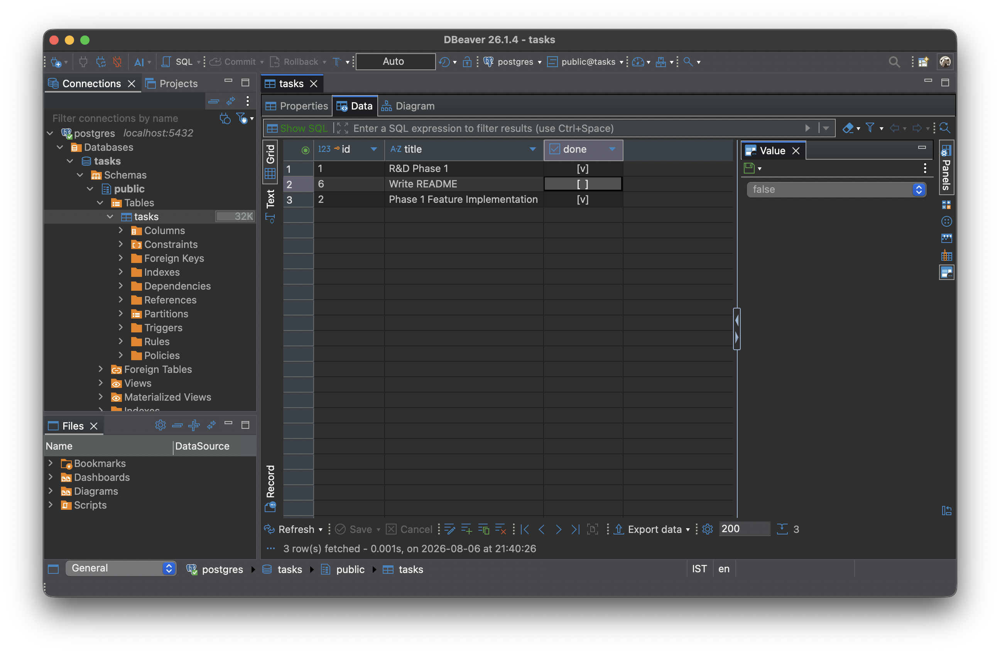

# task API

A minimal CRUD API built with FastAPI. Tasks are stored in Postgres. The API and the database both run in Docker, started with a single `docker compose up`.

## Why Postgres + Docker

- **Real database engine** — proper types (`BOOLEAN`, `SERIAL`), concurrent writers, and a network protocol instead of a single file on disk.
- **One command to run everything** — `docker compose up` builds the API image and starts Postgres, wires them together on a private network, and waits for the database to be healthy before starting the API.
- **No local Postgres install** — the database only exists inside the `db` container and its volume; nothing to set up on the host.
- **Data survives restarts** — Postgres writes to the named volume `pgdata`, so `docker compose down` (without `-v`) keeps the data for next time.

## Configuration

Both services read from `.env` (see `.env.example`):

```
POSTGRES_USER=...
POSTGRES_PASSWORD=...
POSTGRES_DB=...
```

`docker-compose.yaml` builds `DATABASE_URL` for the API container from those values, pointed at the `db` service:

```
postgresql://${POSTGRES_USER}:${POSTGRES_PASSWORD}@db:5432/${POSTGRES_DB}
```

`main.py` reads `DATABASE_URL` directly via `python-dotenv` / `os.environ`. `init_db()` runs at import time: creates the `tasks` table if missing, seeds three rows only when the table is empty.

## Install & run

Requires Docker and Docker Compose.

```bash
cp .env.example .env   # fill in POSTGRES_USER / POSTGRES_PASSWORD / POSTGRES_DB
docker compose up -d --build
```

Server runs at `http://localhost:8000`. Postgres runs at `localhost:5432` (also reachable from your host, e.g. with `psql` or a GUI client).

To reset the data, drop the volume and start fresh:

```bash
docker compose down -v
docker compose up -d --build
```

### Running without Docker

Requires Python 3.14+, [uv](https://docs.astral.sh/uv/), and a Postgres instance reachable at the `DATABASE_URL` in `.env`.

```bash
uv sync
uv run uvicorn main:app --port 8000 --reload
```

## Endpoints

| Method | Path | Description | Status |
|--------|------|-------------|--------|
| GET | `/` | API info | 200 |
| GET | `/health` | Health check | 200 |
| GET | `/tasks` | List all tasks | 200 |
| GET | `/tasks/{id}` | Get one task | 200 / 404 |
| POST | `/tasks` | Create task (`title` required) | 201 / 400 |
| PUT | `/tasks/{id}` | Update task (`title`, `done` required) | 200 / 400 / 404 |
| DELETE | `/tasks/{id}` | Delete task | 204 / 404 |

`done` comes back as a real JSON boolean (`true`/`false`) — Postgres has a native `BOOLEAN` type.

## API docs

Swagger UI at `http://localhost:8000/docs` (or Interactive docs at `http://localhost:8000/redoc`).


## Database viewer



## SQL used

The schema, created by `init_db()`:

```sql
CREATE TABLE IF NOT EXISTS tasks (
    id      SERIAL PRIMARY KEY,
    title   TEXT NOT NULL,
    done    BOOLEAN DEFAULT FALSE
);
```

`id` is assigned by a Postgres sequence (`SERIAL`), not by the seed data — the seed rows below get whatever ids the sequence is on, not necessarily `1, 2, 3`.

Seed rows, inserted only when the table is empty:

```sql
SELECT 1 FROM tasks LIMIT 1;
INSERT INTO tasks (title, done) VALUES (%(title)s, %(done)s);
```

The queries behind each endpoint:

```sql
-- GET /tasks
SELECT * FROM tasks;

-- GET /tasks/{id}
SELECT * FROM tasks WHERE id = %s;

-- POST /tasks   (id assigned by Postgres)
INSERT INTO tasks (title, done) VALUES (%s, %s) RETURNING *;

-- PUT /tasks/{id}
UPDATE tasks SET title = %s, done = %s WHERE id = %s RETURNING *;

-- DELETE /tasks/{id}
DELETE FROM tasks WHERE id = %s RETURNING *;
```

`RETURNING *` gives back the affected row in one round trip, so the API can respond with the new state — and a `None` result means the id didn't exist, which is how 404s are detected.

Values are always passed as bound parameters (`%s` / `%(name)s`), never string-formatted into the SQL.

Inspect the database directly:

```bash
docker exec -it flyrank-pg psql -U <POSTGRES_USER> -d <POSTGRES_DB> -c '\d tasks'
docker exec -it flyrank-pg psql -U <POSTGRES_USER> -d <POSTGRES_DB> -c 'SELECT * FROM tasks;'
```

## Testing with curl

### `GET /` — API info

Returns basic metadata about the API.

```bash
curl -s http://localhost:8000/
```

**Response**
```json
{"name":"Task API","version":"1.0","endpoints":"[/tasks]"}
```

### `GET /health` — Health check

Confirms the server is up.

```bash
curl -s http://localhost:8000/health
```

**Response**
```json
{"status":"working"}
```

### `GET /tasks` — List all tasks

Returns every row in the `tasks` table.

```bash
curl -s http://localhost:8000/tasks
```

**Response** — ids come from the Postgres sequence, so exact numbers will vary run to run
```json
[{"id":1,"title":"R&D Phase 1","done":true},{"id":2,"title":"Phase 1 Feature Implementation","done":false},{"id":3,"title":"Intern Meet","done":false}]
```

### `GET /tasks/{id}` — Get one task

Returns a single task by id, or a 404 if it doesn't exist.

```bash
curl -s http://localhost:8000/tasks/1
```

**Response**
```json
{"id":1,"title":"R&D Phase 1","done":true}
```

```bash
curl -s http://localhost:8000/tasks/999
```

**Response** — `404`
```json
{"detail":"Task 999 not found"}
```

### `POST /tasks` — Create a task

Inserts a task from a `title`; Postgres assigns the id. Rejects an empty title.

```bash
curl -s -X POST http://localhost:8000/tasks \
  -H 'Content-Type: application/json' \
  -d '{"title": "Write README"}'
```

**Response** — `201`
```json
{"id":4,"title":"Write README","done":false}
```

```bash
curl -s -X POST http://localhost:8000/tasks \
  -H 'Content-Type: application/json' \
  -d '{"title": ""}'
```

**Response** — `400`
```json
{"detail":"title must exist and be a non-empty string"}
```

### `PUT /tasks/{id}` — Update a task

Replaces `title` and `done` on an existing row; 404 if the id doesn't exist.

```bash
curl -s -X PUT http://localhost:8000/tasks/2 \
  -H 'Content-Type: application/json' \
  -d '{"title": "Phase 1 Feature Implementation", "done": true}'
```

**Response**
```json
{"id":2,"title":"Phase 1 Feature Implementation","done":true}
```

### `DELETE /tasks/{id}` — Delete a task

Removes a row by id; 404 if it doesn't exist.

```bash
curl -s -i -X DELETE http://localhost:8000/tasks/3
```

**Response**
```
HTTP/1.1 204 No Content
```
