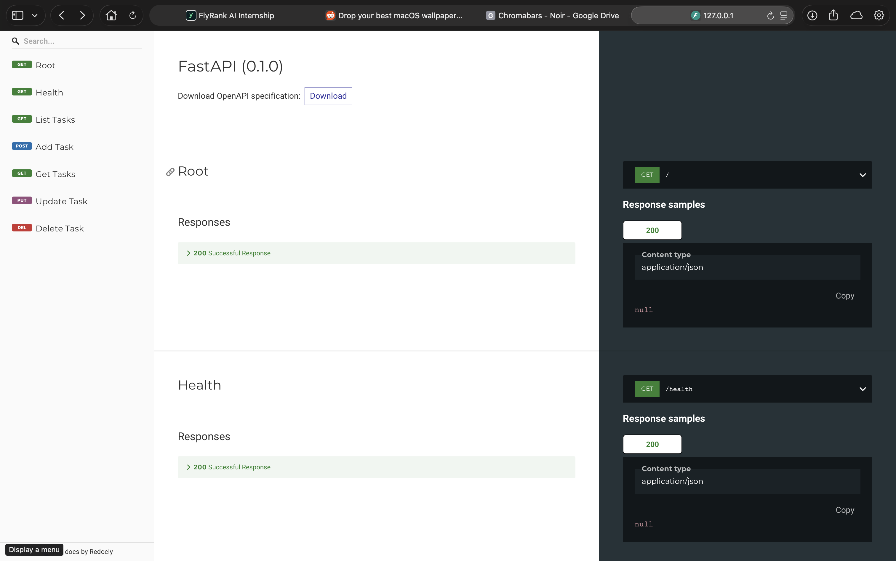

# Task API

A minimal CRUD API built with FastAPI. Manages a list of tasks held in memory — no database, data resets on restart.

## Install & run

Requires Python 3.14+ and [uv](https://docs.astral.sh/uv/).

```bash
uv sync
uv run uvicorn main:app --port 8000
```

Server runs at `http://localhost:8000`.

## Endpoints

| Method | Path | Description | Status |
|--------|------|-------------|--------|
| GET | `/` | API info | 200 |
| GET | `/health` | Health check | 200 |
| GET | `/tasks` | List all tasks | 200 |
| GET | `/tasks/{id}` | Get one task | 200 / 404 |
| POST | `/tasks` | Create task (`title` required) | 201 / 400 |
| PUT | `/tasks/{id}` | Update task (`title`, `done` required) | 200 / 400 / 404 |
| DELETE | `/tasks/{id}` | Delete task | 204 / 404 |

## API docs (ReDoc)

Interactive docs at `http://localhost:8000/redoc` (or Swagger UI at `http://localhost:8000/docs`).



## Testing with curl

```bash
curl -s http://localhost:8000/
```
```json
{"name":"Task API","version":"1.0","endpoints":"[/tasks]"}
```

```bash
curl -s http://localhost:8000/health
```
```json
{"status":"working"}
```

```bash
curl -s http://localhost:8000/tasks
```
```json
[{"id":101,"title":"R&D Phase 1","done":true},{"id":102,"title":"Phase 1 Feature Implementation","done":false},{"id":103,"title":"Intern Meet","done":false},{"id":104,"title":"Client Pitch","done":true}]
```

```bash
curl -s http://localhost:8000/tasks/101
```
```json
{"id":101,"title":"R&D Phase 1","done":true}
```

```bash
curl -s http://localhost:8000/tasks/999
```
```json
{"error":"Task 999 not found"}
```

```bash
curl -s -X POST http://localhost:8000/tasks \
  -H 'Content-Type: application/json' \
  -d '{"title": "Write README"}'
```
```json
{"message":"created","task":{"id":105,"title":"Write README","done":false}}
```

```bash
curl -s -X POST http://localhost:8000/tasks \
  -H 'Content-Type: application/json' \
  -d '{"name": "no title"}'
```
```json
{"error":"title should exist and should be a string"}
```

```bash
curl -s -X PUT http://localhost:8000/tasks/102 \
  -H 'Content-Type: application/json' \
  -d '{"title": "Phase 1 Feature Implementation", "done": true}'
```
```json
{"id":102,"title":"Phase 1 Feature Implementation","done":true}
```

```bash
curl -s -i -X DELETE http://localhost:8000/tasks/103
```
```
HTTP/1.1 204 No Content
```
